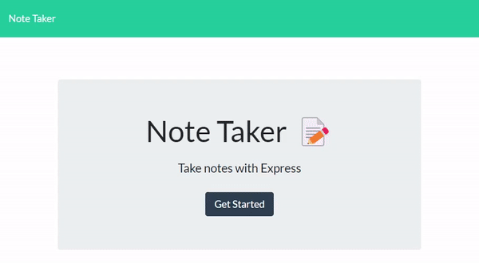

# Note Taker

## Description

Heroku hosted app for taking and storing notes.

## Table of Contents

- [Installation](#installation)
- [Usage](#usage)
- [Contact](#contact)
- [License](#license)

## Installation

This app runs in the browser.

For a local copy, run `npm i` to install dependencies, then `node server.js` to open a port to localhost:3001 where you can then access the app in your browser of choice

## Usage

## Contact

Repo for this project: [github.com/freyaliesel/Note-Taker](https://github.com/freyaliesel/Note-Taker) 
Find more projects: [github.com/freyaliesel](https://github.com/freyaliesel) 
Questions: email [freyacodes@gmail.com](mailto:freyacodes@gmail.com)

## License

 Copyright (C) K Glidden 2022

This program is free software: you can redistribute it and/or modify it under the terms of the GNU Affero General Public License as published by the Free Software Foundation, either version 3 of the License, or (at your option) any later version.
This program is distributed in the hope that it will be useful, but WITHOUT ANY WARRANTY; without even the implied warranty of MERCHANTABILITY or FITNESS FOR A PARTICULAR PURPOSE.  See the [GNU Affero General Public License](https://www.gnu.org/licenses/agpl-3.0) for more details.